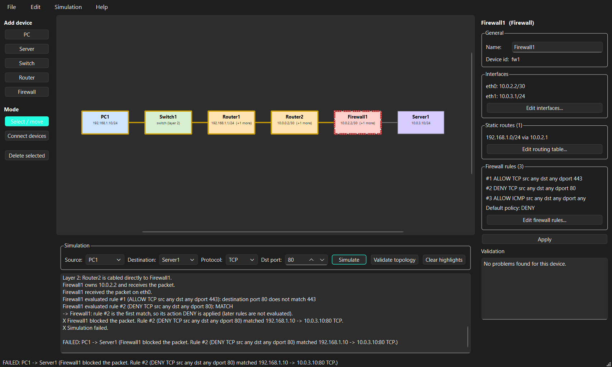

# NetSim MVP — Network Topology Designer & Simulator

A working vertical slice of the "NetSim" semester project: a PyQt6 desktop
application in which you draw a network, configure IPv4 addressing, routing
and firewall rules, press **Simulate**, and get back a highlighted path plus a
human-readable explanation of every decision the simulator made.

This repository is a **feasibility prototype**, not the finished semester
deliverable. It exists to answer one question: *can three students build the
full NetSim in 15 weeks?* See [Feasibility Assessment](#feasibility-assessment)
at the end.

---



## What it does

* Desktop GUI (PyQt6) with a `QGraphicsScene` topology canvas.
* Five device types: **PC, Server, Switch, Router, Firewall**.
* Place devices, drag them, select them, cable them together, delete them.
* Configure IPv4 addresses, prefixes and default gateways.
* Routers and firewalls have **multiple interfaces** and a **static routing
  table**; connected routes are derived automatically.
* Ordered, first-match-wins **firewall rules** with a configurable default policy.
* A **GUI-independent simulation engine** that returns a structured
  `SimulationResult`.
* Longest-prefix-match routing, gateway validation, layer-2 delivery through
  switches, loop detection.
* Path highlighting on the canvas (green = success, yellow = attempted, red =
  where it stopped) and an educational log in the console.
* JSON topology save/load with a documented schema.
* SQLite simulation history.
* 103 automated tests that run **without PyQt**.

## What it deliberately does NOT do

No packets are ever sent. Nothing touches a real network interface, a socket,
or any hardware. Explicitly out of scope for this MVP:

packet animation · real traffic · sockets · real ping/traceroute · packet
capture · ARP · DHCP · DNS · NAT · VLANs · STP · MAC addresses · TCP/UDP state
machines · OSPF/BGP/RIP · IPv6 · wireless · bandwidth, latency or loss
modelling · queues · attack simulation · IDS/IPS · authentication · user
accounts · collaboration · plugins · cloud sync · installers · pretty icons.

Two further scope limits worth stating up front:

* Simulation is **one-directional**. We follow a packet from source to
  destination; we do not simulate the reply. A path that works one way may not
  work in reverse if return routes are missing.
* The firewall is **stateless** and is evaluated **once, on ingress**, in the
  direction of travel.

---

## Requirements

* **Python 3.12+** (developed and verified on 3.13.5)
* `PyQt6` — GUI only
* `networkx` — physical-connectivity graph helpers
* `pytest` — tests

## Installation

### Linux / macOS

```bash
conda create --name netsim python=3.12
conda activate netsim
python -m pip install -r requirements.txt
```

Run these commands from the `MVP` directory. If `conda activate` is not
recognized, initialize Conda for your shell with `conda init`, then restart
the terminal.

### Windows (Anaconda Prompt or PowerShell)

```powershell
conda create --name netsim python=3.12
conda activate netsim
python -m pip install -r requirements.txt
```

If `conda` is not recognized in PowerShell, use Anaconda Prompt or run
`conda init powershell`, then restart PowerShell.

To leave the environment:

```bash
conda deactivate
```

To remove the environment later:

```bash
conda env remove --name netsim
```

## Running

Launch the GUI:

```bash
python main.py
```

Run the engine with no GUI at all (the six required demonstrations):

```bash
python demo_cli.py
```

Run the test suite:

```bash
python -m pytest
```

Drive the GUI headlessly (optional, for when you change the GUI):

```bash
python gui_smoke_test.py screenshot.png
```

On a machine with no display, prefix that with `QT_QPA_PLATFORM=offscreen`
(Linux) or `$env:QT_QPA_PLATFORM="offscreen"` (PowerShell).

---

## Quick start in the GUI

1. **File → Load demo topology.** You get
   `PC1 — Switch1 — Router1 — Router2 — Firewall1 — Server1`, fully configured.
2. At the bottom choose Source `PC1`, Destination `Server1`, Protocol `ICMP`,
   Dst port `(none)`, then press **Simulate**. The path turns green and the
   console explains every hop.
3. Change Protocol to `TCP` and Dst port to `80`. Simulate again: the packet is
   dropped at `Firewall1`, which turns red, and the log names rule #2.
4. Change the port to `443`: allowed by rule #1, green again.
5. Select `Firewall1`, press **Edit firewall rules…**, use **Move up** /
   **Move down** to put the DENY rule above the ALLOW rule, and re-simulate to
   see rule order change the outcome.

### Building a topology from scratch

1. Click **PC**, **Switch**, **Router**, … in the left palette. Each click drops
   a device on the canvas.
2. Drag devices around in **Select / move** mode.
3. Press **Connect devices**, click device A, then click device B. NetSim picks
   the first free interface on each side. Press **Esc** to cancel.
4. Click a device to configure it in the right-hand panel:
   * **PC / Server** — name, IPv4 address, prefix, default gateway. Press **Apply**.
   * **Router / Firewall** — **Edit interfaces…** (name, address, prefix) and
     **Edit routing table…**.
   * **Firewall** — additionally **Edit firewall rules…** and the default policy.
   * **Switch** — name only; a switch has no IP address.
5. Select a device or a link and press **Delete** (or the **Delete selected**
   button) to remove it. Deleting a device removes its cables too.
6. **File → Save as…** writes a JSON file; **File → Open…** reads one back.
7. **Simulation → Simulation history…** shows what SQLite has recorded.

The **Validate topology** button lists configuration problems without running a
simulation. The Validation box in the properties panel shows only the problems
that concern the selected device.

---

## How routing works

Every layer-3 device forwards using a table built from two sources:

1. **Connected routes**, derived automatically from each validly configured
   interface. A router with `eth0 = 192.168.1.1/24` always knows
   `192.168.1.0/24`. Metric 0.
2. **Static routes** you type in: destination network, prefix, next hop,
   outgoing interface, metric.

Route selection is **longest-prefix match**. Given

```
10.0.0.0/8      via A
10.10.0.0/16    via B
10.10.20.0/24   via C
```

a packet for `10.10.20.50` takes the `/24` route. Ties on prefix length are
broken by metric, then connected-before-static, then table order.

A route is only usable if its **next hop is on one of the device's own
subnets** — a next hop is a neighbour, not an arbitrary address. Validation
says so explicitly, and the simulation fails with a clear message if it is not.

An end host compares the destination with its own network:

* **Same network** → deliver at layer 2. A switch floods to the rest of the
  segment; a router or firewall stops the search. If the two hosts are on
  different subnets, the switch cannot help, and the simulation says so.
* **Different network** → a **default gateway** is required, and it must be
  inside the host's own subnet, and it must belong to a router or firewall.

Loop protection: the engine remembers every `(device, ingress interface)` state
it has visited. A repeat is reported as a routing loop, naming the devices. A
hop limit of 32 is a second safety net.

## How firewall rules work

Rules are an ordered list on the firewall device. Each rule has:

| field | meaning |
| --- | --- |
| enabled | disabled rules are skipped (but still reported in the log) |
| action | `ALLOW` or `DENY` |
| protocol | `ANY`, `TCP`, `UDP`, `ICMP` |
| source | address or CIDR, empty = any |
| destination | address or CIDR, empty = any |
| dst port | integer 1–65535, empty = any (TCP/UDP only) |
| comment | free text |

Evaluation is **top to bottom, first match wins**. A later `DENY` cannot
override an earlier `ALLOW` — this is the single most important behaviour to
demonstrate, because it is what distinguishes a real rule engine from "search
the list for a deny".

If **no rule matches**, the device's **default policy** applies. The MVP
default is **DENY** (deny-by-default whitelist model), which is how perimeter
firewalls are normally configured. It is configurable per firewall.

A malformed rule (bad address, out-of-range port) is **skipped with a warning**
rather than crashing or silently matching.

## Error handling

Three kinds of problem are kept apart deliberately:

1. **Configuration errors** — the topology is wrong. Reported by
   `netsim/simulation/validation.py` as errors and warnings with messages
   written for students, e.g.

   > PC1 has gateway 192.168.2.1, but PC1 is configured as 192.168.1.10/24. The
   > gateway is outside the local 192.168.1.0/24 subnet, so PC1 can never send
   > anything to it.

2. **Simulation failures** — the configuration is legal but this packet cannot
   get through. Reported in the `SimulationResult` with a machine-readable
   `FailureReason` (`no_route`, `firewall_blocked`, `routing_loop`, …), a
   failure message, and the device where it stopped.

3. **Programming errors** — bugs. They raise, and the GUI catches them at the
   button handler, shows a dialog and prints the traceback to the console
   instead of dying.

Validation covers: invalid addresses and prefixes, network/broadcast addresses
used as host addresses, duplicate addresses, missing or out-of-subnet
gateways, gateways pointing at the host itself, unusable routes (bad network,
host bits set, unreachable next hop, missing target, unknown interface),
malformed firewall rules, ports on protocols that have none, isolated devices,
unplugged addressed interfaces, and subnet mismatches across a direct cable.

---

## Project structure

```
netsim_mvp/
    main.py                     GUI launcher
    demo_cli.py                 headless demonstration of all scenarios
    gui_smoke_test.py           headless GUI driver + screenshot
    requirements.txt
    pytest.ini
    examples/demo_topology.json exported demo topology
    docs/screenshot.png         the GUI showing a blocked simulation

    netsim/
        domain/                 <- no dependencies on anything above
            models.py           Device, Interface, Route, FirewallRule, Connection
            topology.py         Topology container + NetworkX graph helpers
        simulation/             <- depends only on domain
            l2.py               layer-2 segment resolution (switch flooding)
            routing.py          routing table construction + longest prefix match
            firewall.py         ordered rule evaluation
            validation.py       configuration validation
            engine.py           the simulation algorithm
            result.py           SimulationRequest / SimulationResult / Hop / log
        persistence/            <- depends only on domain + result
            json_store.py       schema v1 save/load
            database.py         SQLite simulation history
        app/
            controller.py       integration layer used by BOTH the GUI and the CLI
        samples/
            demo.py             sample topologies (data only)
        gui/                    <- the only package that imports PyQt6
            main_window.py      layout, menus, simulation controls, console
            canvas.py           QGraphicsScene/View, modes, highlighting
            device_items.py     QGraphicsItem subclasses
            properties_panel.py right-hand configuration panel
            dialogs.py          interfaces / routes / firewall rule editors

    tests/
        conftest.py             topology builders
        test_validation.py      subnet membership, gateways, addressing, routes
        test_routing.py         table construction, longest prefix, egress
        test_firewall.py        matching, ordering, default policy
        test_simulation.py      the ten required scenarios end to end
        test_persistence.py     JSON round trip, SQLite history
        test_integration.py     full stack + the "no Qt below the GUI" rule
```

## Architecture overview

```
      USER
        |
   GUI (PyQt6)            netsim/gui/*
        |
   Application layer      netsim/app/controller.py
        |
   +----+--------------------+-------------------+
   |                         |                   |
Domain model          Simulation engine     Persistence
netsim/domain/*       netsim/simulation/*   netsim/persistence/*
```

Rules that hold, and are enforced by a test:

* **The simulation engine never imports PyQt.** `test_integration.py` starts a
  subprocess, imports the engine, the controller and persistence, and fails if
  any `PyQt*` module ended up in `sys.modules`. A second test greps every
  module outside `netsim/gui/` for the string `PyQt`.
* **The topology model is the single source of truth.** A `DeviceItem` on the
  canvas stores only `device_id`; it reads names and addresses from the domain
  object and writes back only its x/y position after a drag.
* **The GUI and the CLI use the same `AppController`.** `demo_cli.py` proves
  that the whole stack works with no Qt event loop.

### The data model

```
Topology
 ├── devices: {id -> Device}
 │     ├── type: pc | server | switch | router | firewall
 │     ├── name, x, y
 │     ├── interfaces: [Interface(id, name, ip, prefix)]
 │     ├── gateway          (hosts)
 │     ├── routes: [Route(destination, prefix, next_hop, interface_id, metric)]
 │     ├── firewall_rules: [FirewallRule(...)]   (firewalls)
 │     └── default_policy                        (firewalls)
 └── connections: {id -> Connection(a: Endpoint, b: Endpoint)}
                                    Endpoint = (device_id, interface_id | None)
```

A **Network** is not an object: it is derived from an interface address with
`ipaddress`, so there is no second copy of the truth to keep in sync. IDs are
short, stable strings (`router-3`, `if-7`, `link-2`) that survive a JSON round
trip and are what the GUI references.

### The simulation algorithm

1. Resolve source and destination; both must be a PC or a Server.
2. Validate the topology. Errors on the source or destination stop the run
   immediately; errors elsewhere become warnings in the log and the simulation
   proceeds until it hits them naturally.
3. Check physical connectivity (NetworkX). Not connected → stop early with a
   clear message.
4. Source host: is the destination on my subnet?
   * yes → layer-2 delivery through switches only;
   * no → require a valid default gateway on the local subnet, then resolve it
     at layer 2 and hand the packet to that router/firewall.
5. At each layer-3 device: if it is a firewall, evaluate the rules; then build
   the routing table, take the longest-prefix match, resolve the egress
   interface and next hop, and resolve that next hop at layer 2.
6. Delivery when the layer-2 lookup lands on the destination host with the
   destination address; failure otherwise.
7. Loop detection on `(device, ingress interface)`; hop limit 32.

Note what this is *not*: it is **not** a shortest-path search over the graph.
NetworkX is used only to answer "is there a cable path at all?" A physically
connected path is never accepted as an IP route.

## JSON schema (version 1)

```json
{
  "version": 1,
  "name": "NetSim demo topology",
  "devices": [
    {
      "id": "pc1",
      "type": "pc",
      "name": "PC1",
      "position": {"x": -360.0, "y": -40.0},
      "interfaces": [
        {"id": "pc1-eth0", "name": "eth0", "ip": "192.168.1.10", "prefix": 24}
      ],
      "gateway": "192.168.1.1"
    },
    {
      "id": "fw1",
      "type": "firewall",
      "name": "Firewall1",
      "position": {"x": 280.0, "y": -40.0},
      "interfaces": [
        {"id": "fw1-eth0", "name": "eth0", "ip": "10.0.2.2", "prefix": 30},
        {"id": "fw1-eth1", "name": "eth1", "ip": "10.0.3.1", "prefix": 24}
      ],
      "routes": [
        {"destination": "192.168.1.0", "prefix": 24, "next_hop": "10.0.2.1",
         "interface_id": "fw1-eth0", "metric": 10}
      ],
      "default_policy": "deny",
      "firewall_rules": [
        {"id": "fw1-rule-1", "action": "allow", "protocol": "tcp",
         "src": null, "dst": null, "dst_port": 443, "enabled": true,
         "description": "allow HTTPS to the server LAN"}
      ]
    }
  ],
  "connections": [
    {"id": "link-r2-fw1",
     "a": {"device_id": "r2", "interface_id": "r2-eth1"},
     "b": {"device_id": "fw1", "interface_id": "fw1-eth0"}}
  ]
}
```

`routes`, `firewall_rules`, `default_policy` and `gateway` are only written for
the device types that use them. Unknown fields are ignored on load and missing
optional fields fall back to defaults. A complete example is in
[`examples/demo_topology.json`](examples/demo_topology.json).

## Demo topology and addressing

```
PC1 ── Switch1 ── Router1 ── Router2 ── Firewall1 ── Server1

LAN A              192.168.1.0/24   PC1 .10, Router1 eth0 .1
Router1–Router2    10.0.0.0/30      R1 eth1 .1, R2 eth0 .2
Router2–Firewall1  10.0.2.0/30      R2 eth1 .1, FW1 eth0 .2
LAN B              10.0.3.0/24      FW1 eth1 .1, Server1 .10
```

Router1 carries **both** `10.0.0.0/8` and `10.0.3.0/24` towards Router2, so the
demo itself exercises longest-prefix matching. Firewall1 ships with
`#1 ALLOW TCP 443`, `#2 DENY TCP 80`, `#3 ALLOW ICMP` and default policy DENY.

---

## Manual test / demo procedure

Run `python demo_cli.py` for the headless version of all of this. In the GUI:

| # | Steps | Expected |
| --- | --- | --- |
| 1 | Load demo, simulate `PC1 → Server1` ICMP | Green path through all six devices; log shows gateway check, two routing lookups and firewall rule #3 matching |
| 2 | Select PC1, clear the gateway field, Apply, simulate | Fails at PC1 (red). "PC1 has no default gateway configured…" |
| 3 | Restore gateway `192.168.1.1`, simulate | Succeeds again |
| 4 | Select Router2, Edit routing table…, delete the `10.0.3.0/24` route, simulate | Fails at Router2. "Router2 has no route to 10.0.3.10. Its routing table only covers: …" |
| 5 | Reload the demo. Simulate TCP port 80 | Fails at Firewall1 (red), log names rule #2 |
| 6 | Simulate TCP port 443 | Succeeds, log names rule #1 |
| 7 | Edit firewall rules: set rule #1 to `ALLOW TCP 80` and rule #2 to `DENY TCP 80`, simulate TCP/80 | Allowed (first match wins) |
| 8 | Move the DENY rule above the ALLOW rule, simulate TCP/80 | Blocked. Same two rules, different order, different outcome |
| 9 | Select PC1, set the gateway to `192.168.2.1`, Apply | Validation box explains the gateway is outside 192.168.1.0/24; simulating fails with the same message |
| 10 | Select Router2, point its `10.0.3.0/24` route back at `10.0.0.1`, delete Router1's `10.0.0.0/8` route, simulate | "Routing loop detected: Router1 → Router2 → Router1 → Router2." |
| 11 | Save as `my.json`, File → New topology, File → Open `my.json` | Topology returns with positions, addresses, routes and rules intact |
| 12 | Simulation → Simulation history… | Every run above is listed |

---

## Known limitations

* One-directional simulation; no return path is checked.
* Stateless firewall, evaluated once on ingress.
* A PC/Server has exactly one interface. Routers and firewalls may have many.
* No MAC addresses, no ARP, no switching tables — a switch is a pure flood
  domain. VLANs would change this and are out of scope.
* Switches have no IP addresses (a management address is meaningless here).
* Static routes only; no routing protocols.
* Only one cable per interface; multi-access segments are built with a switch.
* Duplicate IP addresses are a validation error, not a simulated conflict.
* Deleting an interface that still has a cable is refused rather than
  cascading.
* The canvas draws plain rectangles with straight lines. No icons, no routing
  around obstacles, no animation.
* Undo/redo is not implemented.
* The properties panel commits on **Apply**, not live as you type.
* Simulation history has a read-only viewer; there is no search or replay.

---

# Feasibility Assessment

## What this MVP actually proves

Everything below was executed, not estimated:

* `python -m pytest` → **103 passed** (no PyQt imported anywhere in the suite).
* `python demo_cli.py` → all six required demonstrations plus a routing loop,
  with 25 rows written to SQLite.
* `python gui_smoke_test.py` → **27 checks passed**, driving the real
  `MainWindow`: demo load, selection, drag-updates-model, green highlighting on
  success, red firewall on a block, add device, connect devices, delete device,
  validate, save/load round trip, history count, screenshot.

## Risk assessment

| # | Risk | Rating | Why |
| --- | --- | --- | --- |
| 1 | PyQt canvas complexity | **LOW** | `QGraphicsScene`/`View` did the work out of the box. `canvas.py` + `device_items.py` are ~330 lines total. Zoom, rubber-band select and z-ordering are one-liners. |
| 2 | Device drag/drop | **LOW** | `ItemIsMovable` + `ItemSendsGeometryChanges` + `itemChange` is the whole mechanism. Links follow the item in the same callback. |
| 3 | Device-to-device connections | **LOW–MEDIUM** | Click-A-then-click-B is trivial. The *modelling* question is harder: which interface does a cable land on? Solved by putting `interface_id` in the endpoint and auto-picking the first free interface. Drag-to-connect from a specific port would raise this to MEDIUM. |
| 4 | Keeping GUI and model in sync | **LOW** | Only because of one rule: graphics items hold an id and nothing else. Every sync bug we would otherwise have had is designed out. Break that rule and this becomes the project's biggest risk. |
| 5 | Routing engine complexity | **MEDIUM** | `routing.py` is 165 lines and `engine.py` 525, and getting there required thinking, not typing. The subtlety is not the algorithm but the *sequencing*: L2 resolve → L3 decision → L2 resolve. Once that shape was right, the code became short. |
| 6 | Multi-router forwarding | **LOW** | Falls straight out of the loop in `_forward`. Adding routers costs nothing. |
| 7 | Longest-prefix matching | **LOW** | `ipaddress` plus one `sort` key. Six tests, including one where a wrong choice provably breaks delivery. |
| 8 | Firewall rule evaluation | **LOW** | ~145 lines including its rationale docstring. Ordering, disabled rules, default policy and malformed-rule handling are all covered by tests. |
| 9 | JSON serialisation | **LOW** | Explicit dict-building, no `pickle`, no `__dict__` tricks. Round trip preserves the topology *and* produces an identical simulation log. |
| 10 | SQLite persistence | **LOW** | One table, `sqlite3` from the standard library, ~140 lines. |
| 11 | GUI/simulation integration | **LOW** | One method: `controller.run_simulation(...)` returns data, the scene colours itself from it. The result object already carried everything the GUI needed on the first try. |
| 12 | Testing difficulty | **LOW** | The whole engine is testable with plain dataclasses. 103 tests run in ~5 s. The GUI needed a separate offscreen driver, which took ~150 lines. |
| 13 | Cross-platform | **LOW–MEDIUM** | Pure Python + Qt; no platform code, no path assumptions beyond `os.path.join`. Verified on Windows 11 / Python 3.13 / Qt 6.10. **Not yet verified on Linux** — that is a real gap and should be a week-1 chore, not an assumption. |
| 14 | Codebase complexity | **LOW** | ~4 000 lines of implementation (the `netsim` package) + ~1 000 lines of tests. No metaclasses, no plugin system, no inheritance deeper than "subclass a Qt widget". |
| 15 | Maintainability for 3 students | **MEDIUM** | The code is readable and the layers are clean, but **the layer discipline is the whole design**. It survives only if the team enforces it. The two architectural tests exist precisely so a reviewer does not have to. |

## Risks discovered during implementation

Things that turned out different from the original analysis:

1. **NetworkX contributes far less than expected.** It is used for exactly
   three things: build a graph, find isolated nodes, answer `has_path`. All the
   interesting logic — layer-2 flooding, routing, forwarding — had to be written
   by hand, because a graph library has no concept of a subnet or a gateway.
   *If you had budgeted "NetworkX handles the pathfinding", correct that now.*
   The dependency is still worth keeping (isolated-device detection and the
   early "not physically connected" check are free), but it is a convenience,
   not a foundation.

2. **The hard part is layer 2, not layer 3.** The single most important design
   decision in the whole engine is that a layer-2 search floods through
   switches and *stops* at routers, hosts and firewalls. That one restriction is
   what makes "a switch does not route between subnets", "the gateway must be
   on the local segment" and "the next hop must be a neighbour" all fall out
   naturally. We did not anticipate this; it emerged while writing `l2.py`. Any
   design that starts from "run a graph search and then check the IPs" will
   fight this for weeks.

3. **The interface–cable relationship needs deciding early.** "Connect device A
   to device B" is not enough information for a router with two interfaces. We
   had to put `interface_id` into the connection endpoint on the first attempt.
   Retrofitting that after the GUI is written would be painful.

4. **Connected routes must be automatic.** Requiring students to type the
   directly-connected networks into every routing table would make the tool
   feel broken. Deriving them from the interfaces (metric 0) is four lines and
   removes a whole category of confusing failures.

5. **Loop detection needs the ingress interface, not just the device.** Keying
   the visited set on `device_id` alone reports false loops in legitimate
   topologies. `(device_id, ingress_interface_id)` is correct.

6. **The offscreen Qt platform renders no text without fonts**, so a headless
   screenshot shows boxes instead of labels. Harmless, but do not let a CI
   screenshot fool you into thinking the GUI is broken.

7. **Validation errors and simulation failures overlap awkwardly.** A gateway
   outside the local subnet is both. We resolved it by letting validation own
   the message and the engine own the `FailureReason`, but the boundary needs a
   team decision, not an accident.

Nothing was discovered that undermines the proposed architecture. The
GUI/engine split in particular was easier to maintain than expected, and paid
for itself immediately: `demo_cli.py` and the entire test suite exist because
of it.

## Is the 15-week project feasible for 3 developers?

Yes — with conditions, and with a smaller final scope than the brief implies.

The reasoning: this MVP took roughly the effort of **two to three focused
person-weeks** including tests and documentation, and it already contains the
riskiest parts (canvas, forwarding engine, firewall ordering, GUI/model
synchronisation, both persistence layers). Nothing on the remaining list is
harder than what is already working; most of it is breadth, polish and
coursework overhead. Fifteen weeks for three people is roughly 45 person-weeks
of nominal capacity — but students realistically deliver 8–12 productive
person-weeks total across a semester once lectures, exams and other courses are
accounted for. That is still comfortably more than this project needs, provided
the scope does not inflate.

The failure mode for this project is **not** technical difficulty. It is scope
creep — deciding in week 9 to add packet animation, VLANs, or a second
addressing family — and the classic three-person coordination problem of one
person owning the GUI, one the engine, and nobody owning the boundary between
them.

## Semester scope projection

### Already proven (do not re-litigate)
Domain model · layer-2 delivery · routing table + longest-prefix match ·
multi-router forwarding · firewall ordering and default policy · loop detection ·
validation with student-readable messages · structured result · canvas editing ·
path highlighting · JSON schema v1 · SQLite history · the test approach.

### Mandatory for the final deliverable
1. **Verify on Linux in week 1.** Do not carry this as an assumption.
2. Interface-aware connections in the GUI (choose the port when it matters).
3. Undo/redo, or an explicit written decision not to have it.
4. Simulation history browser: list, filter, click to re-highlight a past run.
5. A topology library: 6–10 teaching scenarios shipped as JSON.
6. Better canvas ergonomics: grid snapping, delete confirmation, link labels
   showing the subnet.
7. Round-trip simulation (source → destination *and back*), which is where most
   real misconfigurations show up.
8. Error-handling pass: every dialog, every file operation, every parse.
9. Documentation and a user guide written for the students who will be marked
   on using it.
10. Keep the test suite growing with the code; do not let it rot in week 10.

### Reasonable stretch goals (only if weeks 1–10 went well)
* Static ARP-free "MAC-like" switching table display, for teaching only.
* A step-through mode: advance the simulation one hop at a time.
* Multiple routes per destination with visible tie-breaking (ECMP display).
* A rule-hit counter on firewall rules across a session.
* Export of a simulation report to Markdown or HTML.
* A second protocol family in the firewall (e.g. port ranges).

### Explicitly reject
Packet animation · real traffic or sockets · OSPF/BGP/RIP · NAT · VLAN/STP ·
DHCP/DNS · IPv6 · wireless · bandwidth/latency/loss modelling · TCP state
machines · IDS/IPS or attack simulation · user accounts · collaboration ·
plugin architecture · cloud sync · installers.

Each of these is a project in itself and none of them makes the tool better at
teaching subnetting, routing and firewall policy — which is what it is for.

### Recommended final MVP scope

Everything in this repository, plus the ten mandatory items above, plus a
teaching-scenario library. That is a complete, reliable, demonstrable
university project. Anything beyond it is a bonus, not a plan.

### Suggested division of work

* **Developer A — engine & domain**: routing, firewall, validation, round-trip
  simulation, and the test suite. Owns `netsim/domain` and `netsim/simulation`.
* **Developer B — GUI**: canvas ergonomics, dialogs, undo/redo, history
  browser. Owns `netsim/gui`.
* **Developer C — integration, persistence & content**: controller, JSON/SQLite,
  scenario library, documentation, cross-platform verification, CI. Owns
  `netsim/app`, `netsim/persistence`, `examples/`, and the README.

Developer C owning the boundary layer is deliberate: it gives the GUI/engine
contract a named owner instead of leaving it to whoever touches it last.

## Verdict

**GO WITH CONDITIONS.**

The architecture works, the hard parts are already running, and the remaining
work is breadth rather than risk. The conditions:

1. **Freeze the scope now.** Adopt the mandatory list above and treat the
   rejected list as binding. Revisit only in week 10, only if ahead.
2. **Keep the engine free of Qt.** The two architectural tests in
   `test_integration.py` must stay green. This is what makes the project
   testable, and testability is what makes it finishable.
3. **Verify Linux in week 1**, and keep running the test suite on both
   platforms.
4. **No feature without a test.** The engine is only maintainable by three
   people because its behaviour is pinned down.
5. **Name an owner for the GUI/engine boundary** (see the split above).

If any of those four conditions slips — particularly (1) and (2) — the honest
assessment changes. A NetSim with round-trip simulation, ten good teaching
scenarios and a reliable editor is a strong semester project. A NetSim with
animated packets, half-finished VLANs and an untested engine is not.
