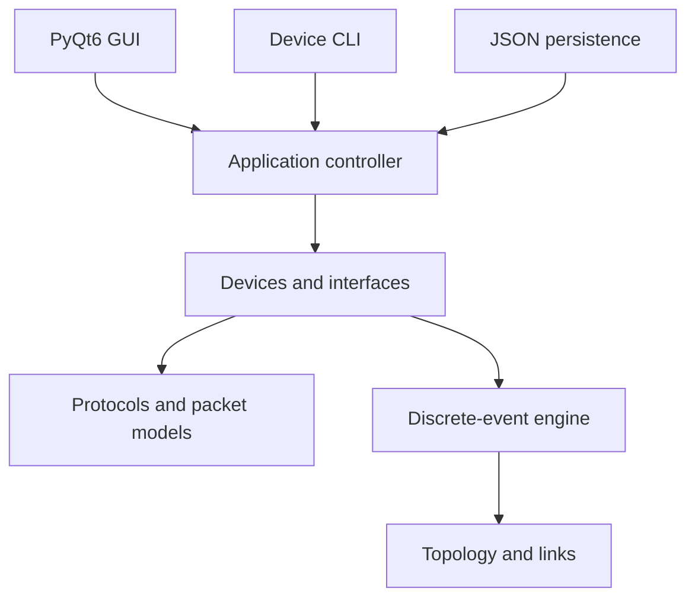
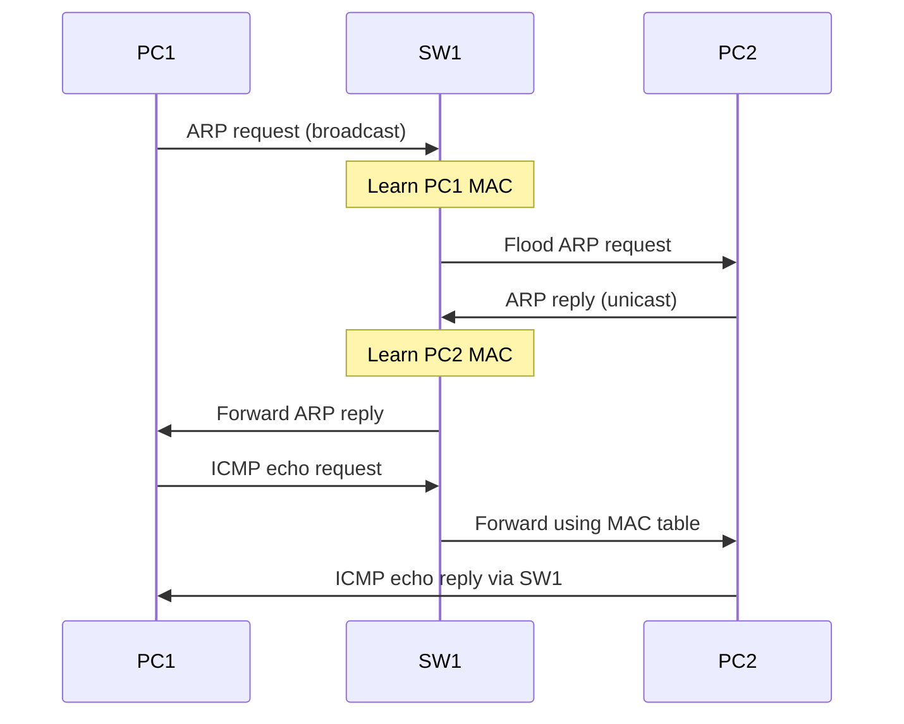

# Python GUI Network Emulator — Design Document

**Status:** Initial design  
**Target language:** Python  
**Desktop framework:** PyQt6  
**Recommended initial scope:** Advanced educational emulator (“scope 2.5”)  

## Planning documents

- [Scope 2.5 Spike](SCOPE_2_5_SPIKE.md) — semester implementation plan for the deterministic educational emulator.
- [Scope 3 Additions](SCOPE_3_ADDITIONS.md) — advanced simulation and optional real-host expansion roadmap.

## 1. Overview

This project is a desktop network emulator inspired by Cisco Packet Tracer. Users construct a topology visually, configure devices through graphical property panels or a CLI, run network operations, and inspect how frames and packets move through the simulated network.

The first version will use Python objects to emulate devices, interfaces, links, packets, protocols, and time. It will not depend on real Linux networking or Docker. However, its architecture will allow real container-backed hosts and services to be added later without replacing the GUI or simulation core.

The project’s defining feature is **observability**: users should be able to pause the network, inspect protocol state, follow individual packets, understand forwarding decisions, and see why traffic succeeds or fails.

## 2. Product Goals

- Provide a drag-and-drop desktop interface for constructing networks.
- Model packet traversal rather than treating connectivity as an abstract graph.
- Teach Ethernet, ARP, IPv4, ICMP, routing, and related protocols through visible behavior.
- Support both visual configuration and a convincing device CLI.
- Produce deterministic, repeatable simulations that can be paused and stepped.
- Keep the emulation model independent of PyQt6 so it can run headlessly and be tested easily.
- Establish extension points for advanced protocols and optional real Linux/container devices.

## 3. Non-Goals for the Initial Release

- Bit-for-bit compatibility with commercial router operating systems.
- Running arbitrary desktop operating systems or virtual machines.
- Complete implementations of TCP congestion control, OSPF, STP, or every protocol edge case.
- Compatibility with arbitrary external networking software.
- Reproducing all Cisco Packet Tracer features.
- Making Docker, Linux namespaces, or root privileges prerequisites.

## 4. Scope Decision

Three possible scopes were considered:

| Scope | Description | Relative difficulty | Expected scale |
|---|---|---:|---|
| 1 — Topology visualizer | Place nodes and links, calculate paths, animate abstract traffic | 3/10 | Weeks |
| 2 — Educational simulator | Simulated Ethernet, ARP, IPv4, ICMP, switching, and routing | 6/10 | Months |
| 3 — Full emulator | Real software, highly accurate stacks, services, complex protocols, containers/VMs | 9/10 | Potentially years |

The recommended target is **scope 2.5**: implement scope 2 using an architecture that can grow toward scope 3. The application should feel like a serious emulator without requiring a complete operating-system network stack.

This includes layered packets, device receive/transmit pipelines, protocol state, an event scheduler, tables, a CLI, and detailed packet inspection. Simplified TCP and application services can be introduced later as controlled simulations.

## 5. User Experience

### 5.1 Main workspace

The main window contains:

- A device palette for PCs, switches, routers, servers, and networks.
- A central topology canvas with movable devices and visible links.
- A properties/inspection panel for the selected object.
- Simulation controls: run, pause, stop, single-step, speed, and reset.
- A packet/event log with filtering and expandable details.
- Per-device CLI consoles.

```text
┌──────────────────────────────────────────────────────────────┐
│ File   Edit   Simulation                         ▶ Run  ■ Stop│
├──────────────┬───────────────────────────────┬───────────────┤
│ DEVICES      │                               │ Properties    │
│              │       [ PC1 ]                 │               │
│ PC           │          │                    │ Name: PC1     │
│ Switch       │       [ SW1 ]────[ R1 ]       │ IP:           │
│ Router       │          │                    │ 10.0.0.2/24   │
│ Server       │       [ PC2 ]                 │ Gateway:      │
│ Network      │                               │ 10.0.0.1      │
├──────────────┴───────────────────────────────┴───────────────┤
│ Simulation / Packet Log                                     │
│ PC1 → ARP broadcast                                         │
│ SW1 → flooded frame                                         │
│ PC2 → ARP reply                                             │
└──────────────────────────────────────────────────────────────┘
```

### 5.2 Core workflow

1. The user drags devices onto the canvas.
2. The user connects compatible interfaces with links.
3. The user configures IP addresses, masks, gateways, ports, and routes.
4. The user opens a device CLI or chooses an action such as **Ping**.
5. The simulator schedules and processes protocol events.
6. Packet animations and the event log explain each hop and decision.
7. The user pauses or steps through events and inspects device state.
8. The topology can be saved to and restored from a JSON project file.

## 6. Functional Requirements

### 6.1 Topology editing

- Add, rename, move, select, duplicate, and delete devices.
- Create and remove point-to-point links between interfaces.
- Prevent invalid or duplicate connections unless supported by the interface type.
- Zoom, pan, and fit the topology to the viewport.
- Show interface names, link state, and optional addressing labels.
- Support undo and redo for topology/configuration changes.

### 6.2 Initial device types

- **PC:** one or more Ethernet interfaces, ARP cache, IP configuration, default gateway, and basic client commands.
- **Switch:** Ethernet ports, source-MAC learning, forwarding/filtering, flooding, and MAC-table aging.
- **Router:** routed interfaces, ARP tables, connected/static routes, longest-prefix matching, forwarding, TTL handling, and ICMP errors.
- **Server:** PC behavior plus simulated services added incrementally.

### 6.3 Initial protocols

The minimum meaningful release supports:

- Ethernet II frames
- MAC addressing and broadcasts
- ARP request, reply, caching, expiration, and unresolved queues
- IPv4 addressing and subnet decisions
- ICMP echo request/reply
- IPv4 TTL decrement and packet drops
- Switch learning and forwarding
- Connected and static IPv4 routes

### 6.4 CLI

Each device exposes commands appropriate to its capabilities. Initial examples:

```text
PC1> ip addr
eth0 192.168.1.10/24 up

PC1> arp
192.168.1.1  00:1A:22:40:33:01

PC1> ping 172.16.0.20
Reply from 172.16.0.20: time=12ms ttl=63

PC1> traceroute 172.16.0.20
1  192.168.1.1
2  10.0.0.2
3  172.16.0.20
```

The CLI must call the same model APIs as the graphical controls. It must not contain a separate implementation of networking behavior.

### 6.5 Inspection and logging

Selecting a device can expose:

- Interfaces and administrative/operational state
- IP and MAC addresses
- ARP cache
- Switch MAC table
- Routing table
- Packet counters and drop counters
- Active protocol timers
- Recent received, transmitted, and dropped packets

Selecting an event or animated packet should reveal its protocol layers and the reason for each forwarding or drop decision.

## 7. Architecture

The project is divided into five primary layers plus persistence and testing support.



### 7.1 `gui`

Responsible for presentation and input only:

- `QGraphicsView` and `QGraphicsScene` topology canvas
- Graphical device and link items
- Device palette
- Properties and state inspectors
- CLI terminal widgets
- Packet animations and event timeline
- Menus, dialogs, and simulation controls

GUI objects reference model identifiers or controller APIs. They do not implement ARP, routing, switching, or packet delivery.

### 7.2 `devices`

Contains network behavior and state:

- `Device`
- `PC`
- `Switch`
- `Router`
- `Server`
- `Interface`
- Routing, ARP, and MAC tables
- Receive/transmit pipelines

Each device owns interfaces, protocol state, and dispatch behavior. A frame must arrive through an interface and leave through an interface; it must never jump directly between graph nodes.

### 7.3 `protocols`

Contains immutable or carefully controlled protocol data models and handlers:

- `EthernetFrame`
- `ARPPacket`
- `IPv4Packet`
- `ICMPMessage`
- Later: UDP datagrams, TCP segments, DHCP, DNS, and application messages

Protocol objects should support validation, human-readable inspection, and serialization where useful.

### 7.4 `simulation`

Contains the deterministic discrete-event engine:

- Simulation clock
- Priority event queue
- Event ordering rules
- Link transmission and propagation delay
- Protocol timers
- Pause, resume, step, speed, and reset
- Structured event publication for the GUI/log

The simulation must not depend on wall-clock threads for correctness. UI animation time is separate from logical simulation time.

### 7.5 `cli`

Contains parsing, validation, command dispatch, help, and output formatting. Commands act on model/controller APIs and may schedule simulation events.

### 7.6 `persistence`

Projects are stored as versioned JSON containing:

- Project/schema version
- Devices and stable identifiers
- Device configuration
- Interfaces
- Links and endpoints
- Canvas positions and display settings
- Optional simulation settings

Transient state such as packets in flight and timers can be excluded initially. Later versions may support simulation snapshots separately from topology files.

## 8. Core Domain Model

Illustrative interfaces, not final implementation:

```python
class Device:
    id: str
    name: str
    interfaces: list[Interface]

    def receive_frame(self, interface: Interface, frame: EthernetFrame) -> None: ...


class Interface:
    id: str
    name: str
    mac_address: str
    ip_configuration: object | None
    admin_up: bool
    link: Link | None


class Link:
    endpoint_a: Interface
    endpoint_b: Interface
    latency_ms: float
    bandwidth_bps: int
    operational: bool


class EthernetFrame:
    src_mac: str
    dst_mac: str
    ethertype: int
    payload: object


class IPv4Packet:
    src_ip: str
    dst_ip: str
    ttl: int
    protocol: int
    payload: object
```

A router’s receive pipeline conceptually behaves as follows:

```python
def receive_frame(self, interface, frame):
    if frame.ethertype == ETHERTYPE_ARP:
        self.handle_arp(interface, frame.payload)
    elif frame.ethertype == ETHERTYPE_IPV4:
        packet = frame.payload
        if packet.dst_ip in self.local_addresses:
            self.handle_local_packet(interface, packet)
        else:
            self.forward_packet(interface, packet)
```

## 9. Simulation Semantics

### 9.1 Event model

Every meaningful action becomes a timestamped event, for example:

- Command issued
- Frame queued for transmission
- Frame delivered to an interface
- Switch source MAC learned
- ARP cache entry inserted or expired
- Route selected
- TTL decremented
- Packet delivered locally
- Packet dropped with a reason
- Timer expired

Events should have stable ordering when their timestamps match. This guarantees repeatable runs and reliable tests.

### 9.2 Example: same-subnet ping



The UI may animate these events, but the model must complete correctly in headless mode with animations disabled.

## 10. Headless Operation

The same emulator should support scripted use without importing PyQt6:

```python
net = Network()

pc1 = net.add_pc("PC1")
r1 = net.add_router("R1")
net.connect(pc1.eth0, r1.eth0)

pc1.eth0.set_ipv4("192.168.1.10/24")
r1.eth0.set_ipv4("192.168.1.1/24")

result = net.run_command("PC1", "ping 192.168.1.1")
net.run_until_idle()
```

This is required for unit testing, automated scenarios, grading, and future alternative front ends.

## 11. Docker and Real-Host Integration

### 11.1 Initial decision

Docker is **not required** for the initial simulator or advanced simulated emulator. Python object models provide:

- Deterministic time and behavior
- Full packet and state inspection
- Pause and single-step controls
- Easy automated testing
- Cross-platform execution
- No privileged networking setup

### 11.2 When containers become useful

Containers become useful only when users need real Linux tools or services, such as:

- Real `ping`, `curl`, `ip`, and `ss` commands
- Nginx or another real web server
- Real DNS or DHCP daemons
- Arbitrary application processes attached to a lab topology

### 11.3 Future hybrid architecture

The device model should support interchangeable backends:

```python
class DeviceBackend(Protocol):
    def start(self) -> None: ...
    def stop(self) -> None: ...
    def transmit(self, interface_id: str, frame: bytes) -> None: ...


class PythonSimBackend:
    pass


class ContainerBackend:
    pass
```

The optional `ContainerBackend` may later manage Docker or Podman containers, Linux network namespaces, virtual Ethernet pairs, and bridges. It must be isolated behind an adapter boundary because it introduces privileges, cleanup concerns, host-platform differences, and nondeterministic real-time behavior.

## 12. Proposed Package Structure

```text
network_emulator/
├── app.py
├── gui/
│   ├── main_window.py
│   ├── topology_scene.py
│   ├── graphics_items.py
│   ├── inspectors.py
│   └── terminal.py
├── core/
│   ├── network.py
│   ├── addressing.py
│   └── events.py
├── devices/
│   ├── base.py
│   ├── pc.py
│   ├── switch.py
│   ├── router.py
│   └── server.py
├── protocols/
│   ├── ethernet.py
│   ├── arp.py
│   ├── ipv4.py
│   └── icmp.py
├── simulation/
│   ├── clock.py
│   ├── scheduler.py
│   └── link.py
├── cli/
│   ├── parser.py
│   ├── commands.py
│   └── formatters.py
├── persistence/
│   ├── schema.py
│   └── project_store.py
└── tests/
    ├── unit/
    ├── scenarios/
    └── gui/
```

## 13. Delivery Roadmap

### Phase 0 — Architecture spike

- Build a headless event scheduler.
- Connect two interfaces with a link.
- Deliver one Ethernet frame deterministically.
- Confirm that the core imports no PyQt6 modules.

**Exit criterion:** A unit test sends a frame between two mock devices and verifies ordered events.

### Phase 1 — Minimum useful network

- PC, interface, link, and switch models
- Ethernet frames
- MAC learning, forwarding, and flooding
- ARP
- IPv4 and ICMP echo
- Headless `ping`

**Exit criterion:** Two PCs connected through a switch discover each other with ARP and complete a ping.

### Phase 2 — Visual editor

- PyQt6 main window
- `QGraphicsScene`/`QGraphicsView` canvas
- Device palette and placement
- Link creation
- Selection and properties
- Save/load JSON
- Packet/event log
- Basic packet animation

**Exit criterion:** A user constructs and runs the Phase 1 topology entirely through the GUI.

### Phase 3 — Routing and CLI

- Router forwarding pipeline
- Connected and static routes
- Longest-prefix matching
- TTL expiration and ICMP errors
- Default gateways
- Device CLI
- `traceroute`

**Exit criterion:** A user configures and tests a multi-router topology through the CLI.

### Phase 4 — Emulator depth

- DHCP and DNS
- UDP
- Simplified TCP state machine
- Simulated HTTP service and `curl`
- VLAN access/trunk ports
- NAT
- Link failure and recovery scenarios

**Exit criterion:** A client obtains configuration, resolves a server name, and accesses a simulated service across routed networks.

### Phase 5 — Advanced protocols

- MAC-table and ARP aging controls
- Spanning Tree or a simplified educational variant
- RIP and/or an OSPF-like dynamic routing implementation
- Routing convergence visualization
- Scenario authoring, expected outcomes, and grading

### Phase 6 — Optional real-host backend

- Container lifecycle adapter
- Host capability detection
- Network namespace and virtual-link integration
- Crash-safe cleanup
- Explicit security and privilege model
- Clear UI distinction between simulated and real devices

This phase should begin only after the pure-Python model and backend interface are stable.

## 14. Testing Strategy

- **Protocol unit tests:** parsing, validation, tables, checksums if modeled, subnet calculations, and routing decisions.
- **Device pipeline tests:** exact receive/forward/drop behavior for a supplied frame.
- **Scheduler tests:** ordering, timer cancellation, pause/step, reset, and reproducibility.
- **Scenario tests:** complete topologies such as switched ping, routed ping, TTL expiry, missing route, ARP timeout, and failed link.
- **Persistence tests:** JSON round trips and schema migration.
- **GUI tests:** topology commands and model synchronization; avoid testing network behavior through the GUI when core tests suffice.
- **Property-based tests:** address/subnet edge cases, routing-table precedence, and randomized event ordering constraints.

Every dropped packet should produce a machine-readable reason that tests can assert and the GUI can explain.

## 15. Key Risks and Mitigations

| Risk | Impact | Mitigation |
|---|---|---|
| GUI and protocol logic become coupled | Difficult testing and rewrites | Enforce a PyQt-free core and controller boundary |
| TCP consumes the project | Long delays before a usable application | Ship Ethernet/ARP/IP/ICMP first; define a deliberately simplified TCP contract |
| Simulation time depends on threads | Nondeterministic behavior and race conditions | Use a single logical event queue; reserve threads for unrelated blocking I/O |
| Feature breadth outruns correctness | Many protocols that do not interact reliably | Add protocols through end-to-end scenarios and explicit exit criteria |
| Project files break as models evolve | Lost or unusable topologies | Version the JSON schema and provide migrations |
| Container integration becomes foundational | Privilege, portability, and cleanup problems | Keep it as an optional backend implemented only in a late phase |
| Cisco-like CLI grows without structure | Duplicated behavior and fragile parsing | Separate parsing/formatting from model commands and configuration APIs |

## 16. Architectural Invariants

These rules should be treated as non-negotiable:

1. The network core has no PyQt6 dependency.
2. A packet traverses interfaces and links; it never teleports between devices.
3. The GUI and CLI invoke the same application/model operations.
4. Simulation correctness depends on logical time, not animation or wall-clock timing.
5. Every forwarding and drop decision can be inspected and explained.
6. Stable IDs, not display names or canvas coordinates, identify model objects.
7. Docker/container support is optional and isolated behind a backend interface.
8. New protocol features include headless tests before GUI presentation work.

## 17. Open Design Questions

- Should the first release support only Ethernet links, or also point-to-point serial-style links?
- How Cisco-like should the CLI syntax be versus using a simpler emulator-specific CLI?
- Should project saves preserve only topology/configuration, or optionally capture live simulation state?
- How realistic should delays, bandwidth limits, queues, and packet loss be in early releases?
- Should simplified TCP expose its simplifications explicitly in the UI?
- Is the first distribution target Linux only, or must Windows and macOS work from the beginning?
- Will the project include guided lessons and grading, or remain a general-purpose lab tool initially?

## 18. Recommended First Milestone

Build a headless vertical slice before creating the full GUI:

```text
PC1 ── SW1 ── PC2
```

The milestone is complete when:

- Both PCs have configurable MAC and IPv4 addresses.
- PC1 determines that PC2 is on the same subnet.
- PC1 broadcasts an ARP request.
- The switch learns and floods correctly.
- PC2 replies and both relevant tables update.
- ICMP echo request and reply traverse the switch.
- The simulator produces a deterministic, readable event trace.
- The entire scenario is covered by automated tests.

Once this works, the PyQt6 interface can visualize an already-correct model instead of becoming the place where networking behavior is invented.
